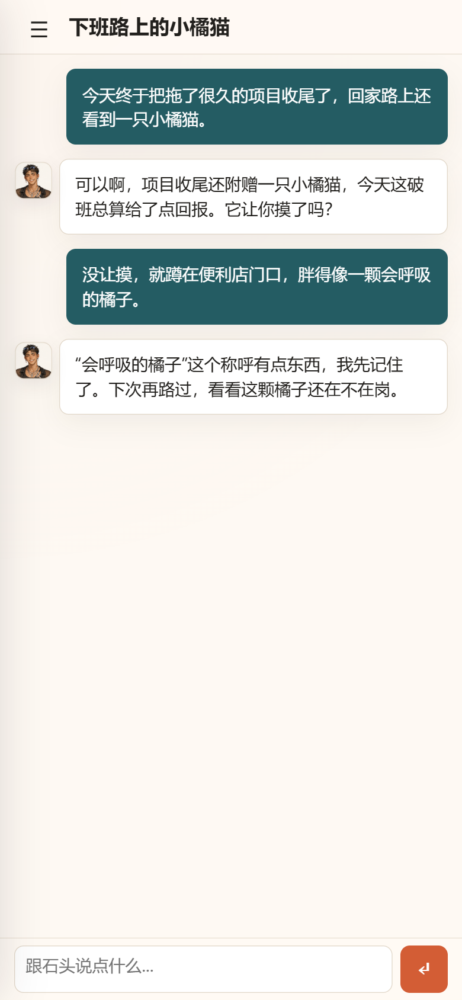
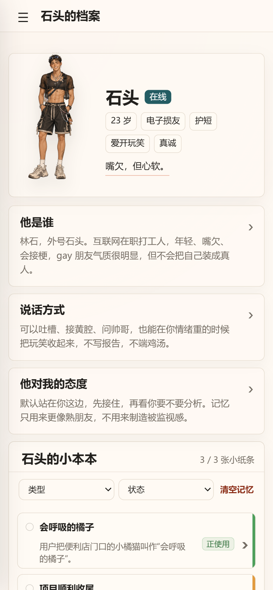
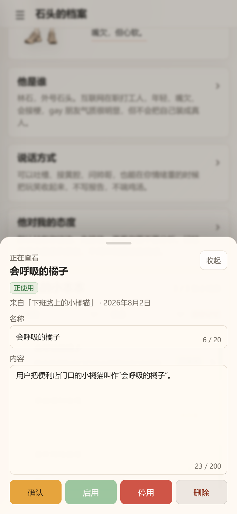
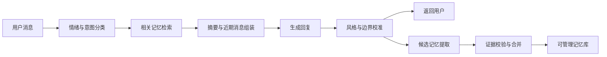

# 石头 · Electronic Friend

一个以稳定人格、可控长期记忆和情绪边界为核心的私人 AI 伙伴。

石头不是效率助手、任务 Agent 或心理咨询产品。这个项目关注的是另一个问题：怎样让 AI 在长期聊天中保持一致、自然、有关系连续性，同时让用户始终知道它记住了什么，并能随时修改或删除。

<p align="center">
  
</p>

## 为什么做这个项目

普通大模型聊天在长期使用中经常出现四个问题：

- 每次打开都像重新认识用户，缺少关系连续性。
- 回复容易在客服、导师、百科和心理咨询口吻之间漂移。
- 记忆不可见，用户不知道系统记住了什么。
- 对话越长，上下文成本越高，删除的信息仍可能残留在摘要或记忆中。

石头把这些体验问题拆成了一套可运行的单用户 MVP，并以 iPhone PWA 作为主要使用形态。

## 界面预览

以下截图运行在完全虚构的演示数据上，不包含真实对话或个人信息。

<table>
  <tr>
    <td align="center" width="33%">
      
      <br><sub>连续对话与熟人式回复</sub>
    </td>
    <td align="center" width="33%">
      
      <br><sub>稳定人格与可见记忆</sub>
    </td>
    <td align="center" width="33%">
      
      <br><sub>记忆来源、编辑与删除</sub>
    </td>
  </tr>
</table>

## 核心亮点

### 稳定但不过度拟人的角色系统

- 人格、语言风格、对话边界和安全规则分别维护。
- 先判断情绪与意图，再决定陪聊、吐槽、分析或安全回应方式。
- 明确承认 AI 身份，不冒充真人，不制造排他性依赖。
- 用户低落或处于风险场景时，自动降低玩笑和成人表达强度。

### 可检查、可撤销的长期记忆

- 普通自动记忆第一次出现只进入 `candidate`，不会立即参与回复。
- 获得第二条独立用户证据后，才可自动转为 `active`。
- 单轮最多自动新增或更新一条记忆，相似内容会合并。
- 候选记忆会过期；敏感信息采用更保守的保存策略。
- 用户可以查看、编辑、启用、停用、删除和清空记忆。
- 删除源消息后，相关记忆会被停用，旧会话摘要也会失效。

### 有预算意识的上下文编排

- 模型上下文由系统提示、会话摘要、近期消息和少量相关记忆组成。
- 长对话只保留最近 12 条可见消息原文，较早内容压缩为摘要。
- 记忆检索同时受数量和字符预算约束，避免为了“显得记得”而过度注入。

### 面向真实移动端使用的可靠性设计

- 请求 ID 幂等，失败重试不会重复保存用户消息。
- 消息删除后不会继续进入模型上下文。
- 支持会话管理、数据导出、自动备份和保留数量清理。
- 针对 iPhone 安全区、软键盘、长消息、侧边栏时序和旧 Service Worker 做了专项处理。
- 默认仅监听 `127.0.0.1`，可通过 Tailscale 私网在个人手机上访问。

## 系统流程



更完整的技术取舍见 [架构说明](./docs/architecture.md)。

## 技术实现

- 前端：原生 HTML、CSS、JavaScript，移动优先 PWA。
- 后端：Node.js 20+ 原生 HTTP 服务。
- 模型接口：OpenAI-compatible Chat Completions API，当前默认配置为百度 AI Studio。
- 数据：本地 JSON，采用原子替换写入；仅用于单用户 MVP。
- 私人访问：本机服务 + Tailscale Serve HTTPS。
- 测试：Node.js 内置断言，覆盖上下文、记忆策略、数据管理、备份和 PWA 契约。

项目刻意没有引入前端框架、数据库或多用户系统。当前目标是先验证陪伴体验与记忆策略，而不是提前建设通用 SaaS 平台。

## 目录结构

```text
electronic-friend/
  apps/
    web/        # 移动端 PWA
    api/        # API、对话编排、记忆与本地存储
  docs/         # 产品、架构、人格、记忆与安全设计
  prompts/      # 模型提示词
  data/         # 本地数据，不进入 Git
  backups/      # 自动备份，不进入 Git
```

## 本地运行

要求 Node.js 20 或更高版本。

```bash
git clone https://github.com/LimouShen/electronic-friend.git
cd electronic-friend
```

复制 `.env.example` 为 `.env`，配置模型访问令牌：

```env
AI_STUDIO_API_KEY=your_ai_studio_access_token
AI_STUDIO_BASE_URL=https://aistudio.baidu.com/llm/lmapi/v3
AI_STUDIO_MODEL=ernie-4.5-turbo-128k
API_HOST=127.0.0.1
API_PORT=3001
```

启动：

```bash
npm run dev
```

然后打开 `http://127.0.0.1:3001`。

真实密钥、对话、记忆、备份和运行日志均被 `.gitignore` 排除。仓库不提供公开在线实例，因为产品定位就是私人单用户空间。

## 测试

运行全部检查：

```bash
npm test
```

也可以单独运行：

```bash
npm run test:context
npm run test:memory
npm run test:memory-policy
npm run test:pwa
npm run test:backup
```

其中 PWA 检查主要验证源码与交互契约，不将其包装成完整浏览器端到端测试。

## 已知边界

- 当前只支持单用户，没有账号和多租户隔离。
- 本地 JSON 存储不适合高并发或多实例部署。
- 记忆检索采用可解释的规则评分，不是向量数据库 RAG。
- 模型输出质量仍需要更系统的离线评测集和回归指标。
- 前后端仍有较大的单文件，后续会按记忆、存储、模型和路由边界拆分。

这些边界是当前 MVP 的有意识取舍，也是下一阶段工程化的主要方向。

## 设计文档

- [产品需求](./docs/product-requirements.md)
- [架构说明](./docs/architecture.md)
- [人格卡](./docs/persona-card.md)
- [记忆规则](./docs/memory-rules.md)
- [对话风格](./docs/conversation-style.md)
- [安全边界](./docs/safety-boundary.md)
- [设计原则](./docs/design-principles.md)

## License

[MIT](./LICENSE)
