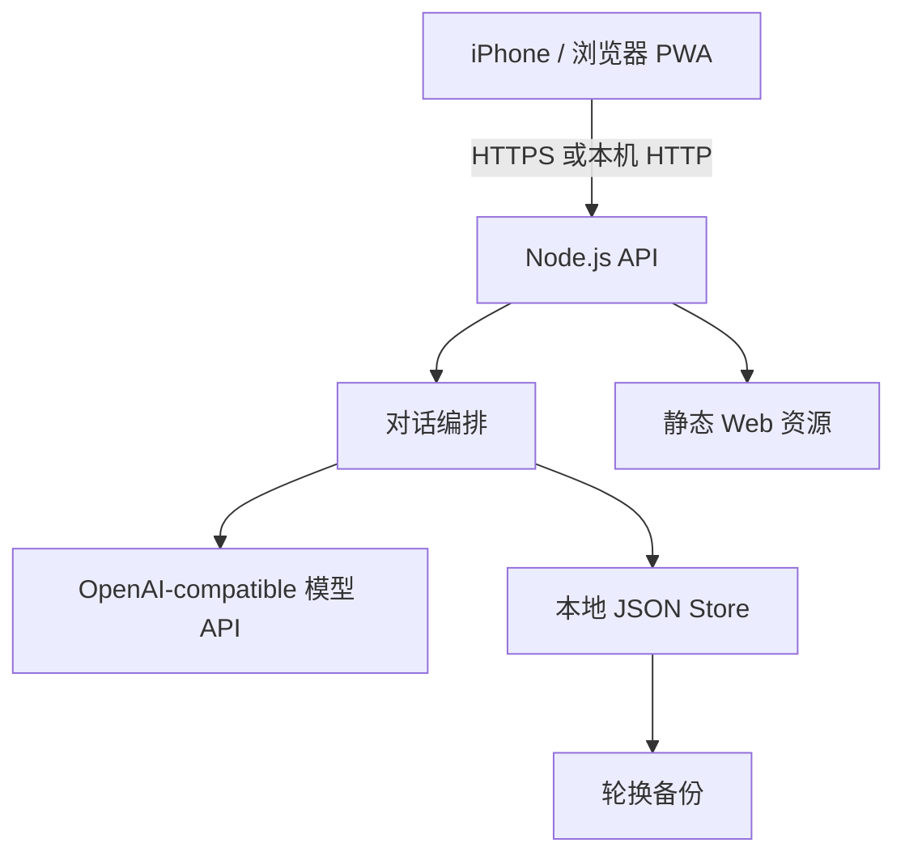
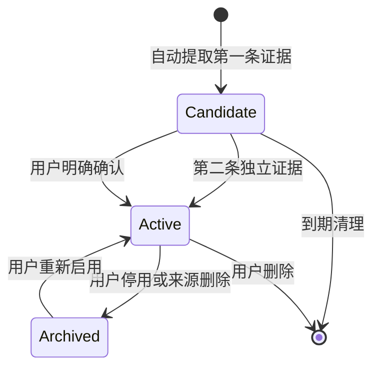

# 架构说明

## 1. 设计目标

石头是单用户私人 AI 伙伴。架构优先保证人格稳定、关系连续、记忆可控和移动端可用性，不以多租户、工具调用或复杂模型路由为当前目标。

## 2. 运行边界

服务默认监听 `127.0.0.1`。个人手机访问时，由 Tailscale Serve 提供私人 HTTPS 入口；真实实例不直接暴露到公网。

## 3. 对话编排

每轮对话分为以下阶段：

1. 校验请求并根据 `request_id` 查找幂等回放。
2. 使用近期消息与相关记忆判断情绪、意图、强度和回复模式。
3. 从启用记忆中选择与当前消息相关的少量条目。
4. 将系统提示、会话摘要、近期消息和记忆组装为模型上下文。
5. 生成初稿，再按人格、语气和安全边界做回复校准。
6. 保存消息，按需生成新摘要并提取候选记忆。

模型分类失败时使用本地保守规则降级，聊天主流程不会因为辅助模型步骤失败而完全不可用。

## 4. 上下文预算

- 最近原文上限：12 条可见消息。
- 摘要触发：会话达到一定长度后，压缩较早消息。
- 记忆上限：同时受条目数和字符数约束。
- 已删除消息不参与近期上下文、摘要或后续检索。

删除消息时会清空可能包含旧内容的摘要，并停用由这些消息产生的记忆，避免“界面删了，但模型仍然知道”。

## 5. 记忆生命周期

关键约束：

- 自动写入单轮最多一条。
- 证据必须对应真实用户消息 ID。
- `candidate` 不进入回复上下文。
- 相似记忆优先合并，不重复堆积。
- API Key、密码、证件和验证码等秘密不保存。
- 用户可查看、修改、停用和删除任何记忆。

## 6. 可靠性与数据控制

- 客户端为发送请求生成唯一 ID，服务端可回放已完成回复。
- 存储写入采用临时文件加重命名，降低中途写坏 JSON 的风险。
- 启动时和固定间隔生成备份，并按数量淘汰旧快照。
- 对话与记忆可以分别导出；清空记忆需要明确确认。
- 密钥仅从服务端环境变量读取，前端只能看到是否已配置。

## 7. 当前取舍

当前实现适合私人单用户 MVP，但不声称具备生产级多租户能力：

- 本地 JSON 不适合并发写入、多实例部署和复杂查询。
- 规则评分检索便于解释，但语义召回能力弱于成熟向量检索。
- Node API 和原生前端仍有较大的单文件，需要继续模块化。
- PWA 检查主要是契约与回归检查，还需要真实浏览器端到端测试。
- 模型回复缺少正式的离线评测集、评分规则和跨模型基准。

下一阶段会优先拆分存储、记忆、模型和路由模块，并建立可重复的对话质量评测集。
